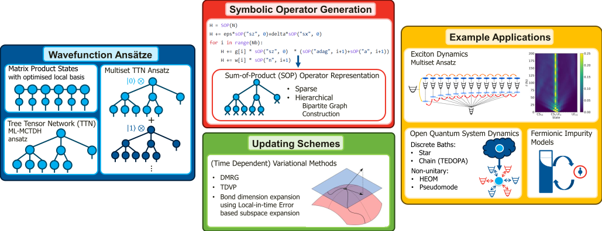

#########################################################################################
pyTTN: An Open Source Toolbox for Quantum Dynamics Simulations Using Tree Tensor Networks
#########################################################################################

|ArXiv| |Python| |Contributor Covenant| |License|

Links
-----
-  Gitlab: https://gitlab.npl.co.uk/quantum-software/pyttn
-  Documentation [WIP]: https://qsm.gitlab-docs.npl.co.uk/pyttn
-  arXiv: https://arxiv.org/abs/2503.15460
-  National Physical Laboratory: https://www.npl.co.uk/

Welcome to the pyTTN documentation.  pyTTN is a python library for performing calculations with Tree Tensor Network states.  
It is designed to make getting started with TTNs quick and easy.  

About pyTTN
This open source project aims to provide an easy to use python interface for working with generic Tree Tensor Networks States to efficiently compute dynamics properties of quantum systems.  A key focus of this library is the easy setup of calculations employing either single or multiset tensor networks with generic tree structured connectivity.  Easy setup of Hamiltonians for arbitrary problems, with the ability to automatically apply techniques such as mode combination to reduce the total number of modes present in the system. Additionally, this library includes several tools to help facilitate applications of these approaches to study the dynamics of quantum systems that are strongly coupled to structured environment using both unitary methods (e.g. TEDOPA, T-TEDOPA and other representations of the system-bath Hamiltonian) as well as non-unitary approaches (e.g. Hierarchical Equations of Motion and Generalised Pseudomode method).

Citing pyTTN
------------

If you publish working using pyTTN, please cite the paper

-  **[pyTTN]** L.P. Lindoy, D. Rodrigo-Albert, Y. Rath, I. Rungger
   *pyTTN: An Open Source Toolbox for Open and Closed System Quantum
   Dynamics Simulations Using Tree Tensor Networks*,
   `arXiv:2503.15460 <https://arxiv.org/abs/2503.15460>`__.

.. code-block::
    
    @misc{Lindoy2025,
        title = {pyTTN: An Open Source Toolbox for Open and Closed System Quantum Dynamics Simulations Using Tree Tensor Network},
        author = {Lindoy, Lachlan P. and Rodrigo-Albert, Daniel. and Rath, Yannic and Rungger, Ivan},
        year = {2025},
        eprint = {2503.15460}, 
        primaryClass={quant-ph},
        archivePrefix={arXiv}, 
        url={https://arxiv.org/abs/2503.15460}
    }

Installation:
-------------
.. toctree::
   :maxdepth: 2

   Installation </Installation/index>

Tutorials:
----------
.. toctree::
   :maxdepth: 2

   Tutorials </Tutorials/index>

Examples:
---------
.. toctree::
   :maxdepth: 2

   Examples </Tutorials/Examples/index>

API:
----
.. toctree::
   :maxdepth: 1

   Package Structure </PackageStructure/package_structure> 
   pyTTN </pyttn/index>
   TTNPP </ttnpp/ttnpp>

Indices and Tables
==================

* :ref:`genindex`
* :ref:`modindex`
* :ref:`search`

.. |ArXiv| image:: https://img.shields.io/badge/arXiv-2503.15460-red
   :target: https://arxiv.org/abs/2503.15460
.. |Python| image:: https://img.shields.io/badge/python-3.9%20|%203.10%20|%203.11%20|%203.12%20|%203.13-blue.svg
   :target: https://gitlab.npl.co.uk/qsm/pyttn
.. |Contributor Covenant| image:: https://img.shields.io/badge/Contributor%20Covena nt-v2.0%20adopted-ff69b4.svg
   :target:  https://gitlab.npl.co.uk/qsm/pyttn/-/blob/main/CODE_OF_CONDUCT.md
.. |License| image:: https://img.shields.io/badge/License-Apache_2.0-blue.svg
   :target: https://opensource.org/licenses/Apache-2.0
